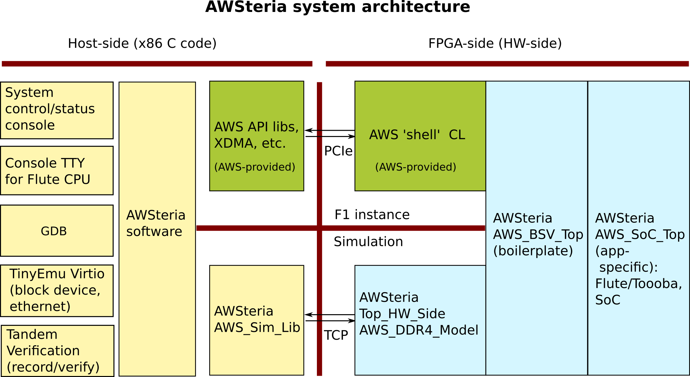
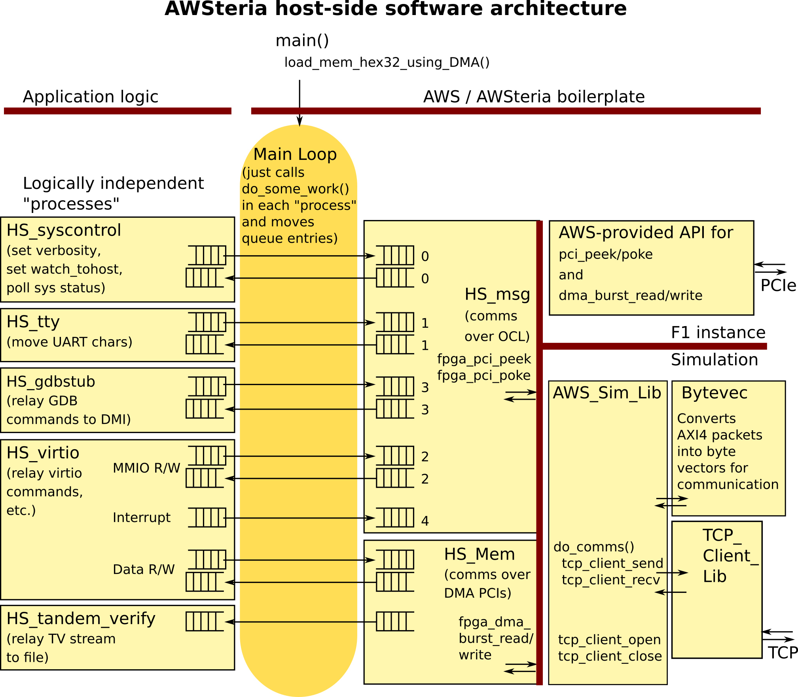
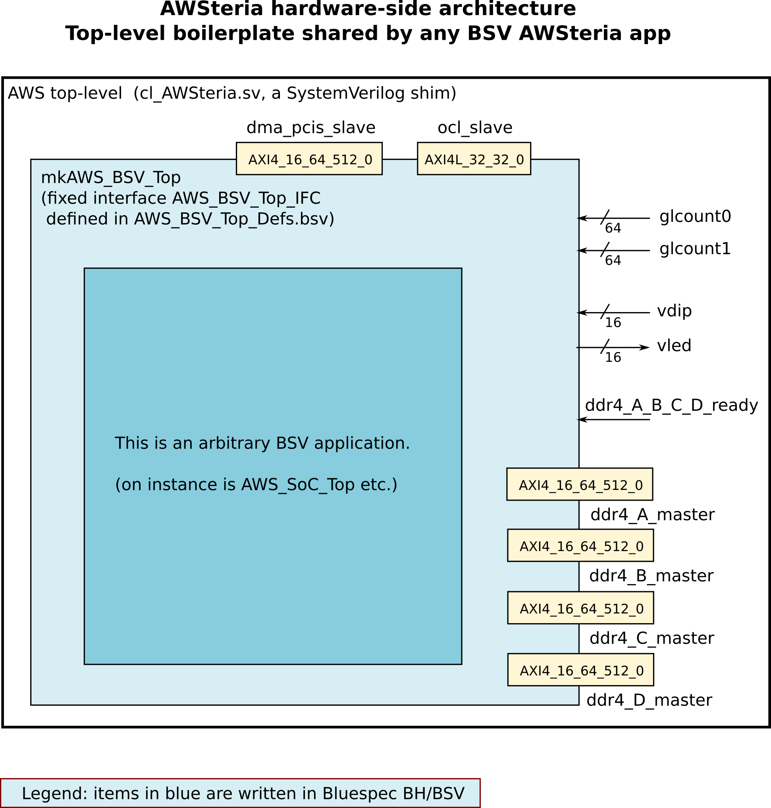
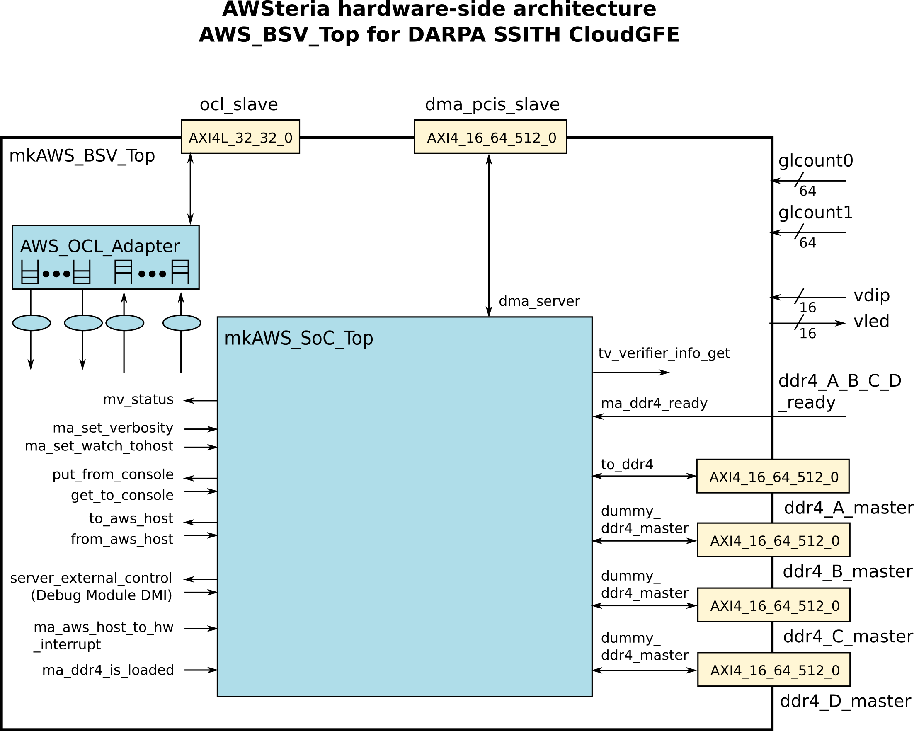
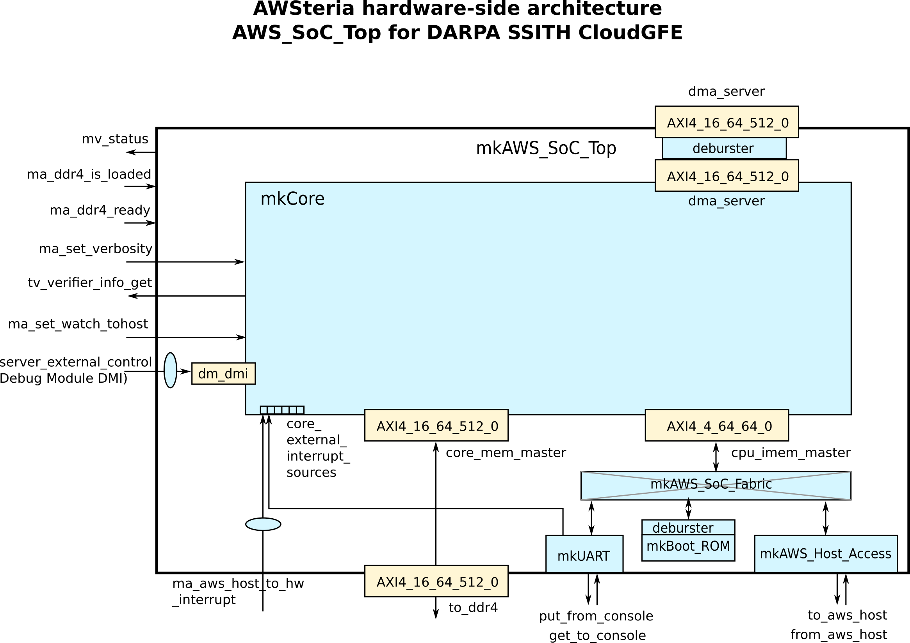
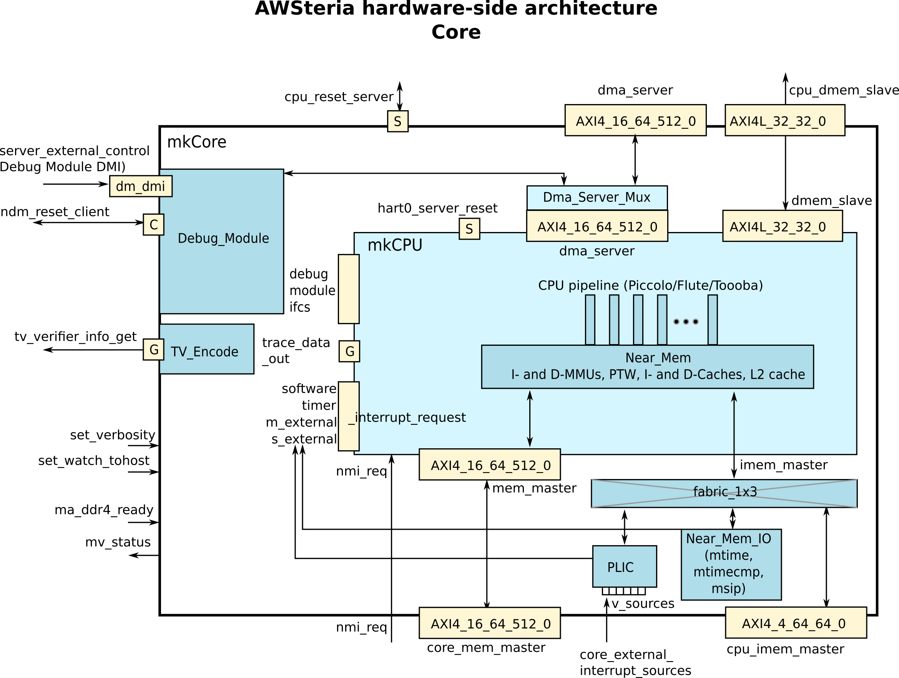

= AWSteria architecture: Host-side and FPGA-side (HW-side)
Rishiyur S. Nikhil, Bluespec, Inc. (c) 2020
:revnumber: v0.1
:revdate: 2020-08-13
:revremark: Draft
:sectnums:
:toc:
:toclevels: 4
:toc: left
:toc-title: Contents
:description: AWSteria architecture
:keywords: AWSteria, AWS, FPGA, F1 Instance, Bluespec, BSV

These diagrams sketch out the top-level layers of Flute and its SoC in
the AWSteria framework.  The diagrams go top-down, starting with the
overall system view (host-side + FPGA-side), then descending into
lower levels.

// ================================================================

'''

== Overall System Architecture

[#Fig_4_System_Arch]
.Overall system architecture

The code on far left and the code on the far right are identical,
whether running on actual hardware (on an FPGA in an AWS F1 instance)
or in simulation (Bluesim, Verilog simulation); they just use
different versions of the parts in the middle.

The functions on the left---System Status/Control, Console TTY, GDB,
Virtio, Tandem Verification---are logically independent functions.  It
involves one or more separate Unix processes, and one or more
"`pthreads`" within the main AWSteria host-side process.

The System Status/Control and the Console TTY should be separate
windows (or panes), which might involve separate processes and/or
pthreads.

GDB is actually a completely separate Unix process talking to a
_gdbstub_ in the AWSteria infrastructure.

Virtio is used to provide block-device and ethernet services, and uses
code from TinyEmu (a small version of Qemu).  It includes one or more
_pthreads_ within the main AWSteria host-side process.

Tandem Verification may be merely file-writes to record the
tandem-verification bytestream coming from the hardware side, but
could also be an on-line connection to a verifier running in
real-time.

// ================================================================

'''

== Host-side Software Architecture

[#Fig_5_Host_Side]
.Host-side software architecture

`HS_msg` mulitiplexes communications from different left-side
functions over the AWS OCL port (AXI4-Lite, 32-bit wide).

`HS_Mem` mulitiplexes communications from different left-side
functions over the AWS DMA PCIs port (AXI4, 512-bit wide).  This is
used for

* Program loading
* Virtio's memory read/write into "`virtqueue`" data structures in Flute's memory.

Current status (August 2020):

* The host-side is just a single Unix process.  The
    logically-independent concurrency of the functions on the left are
    simulated with a "`main loop`" that repeatedly calls a
    `do_some_work()` routine in each function.

* `HS_gdbstub` and `HS_tandem_verify` are still empty skeletons.

In simulation, the AWS API calls
    `fpga_pci_peek()`,
    `fpga_pci_poke()`,
    `fpga_dma_burst_read()`,
    `fpga_dma_burst_write()`
are implemented by AWSteria middleware that simulates the AXI4
communications over TCP.

// ================================================================

'''

== FPGA-side Top-level Architecture (SystemVerilog boilerplate shim)

[#Fig_6_AWS_BSV_TOP_IFC]
.FPGA-side top-level (SystemVerilog shim)

The FPGA-side top-level is the SystemVerilog (SV) file
`cl_AWSteria.sv` whose interface is the AWS-provided SV interface
definition `cl_ports.vh`.  The SV file `cl_AWSteria.sv` is essentially
derived from the `cl_dram_dma.sv` file in Amazon's worked-out "`DRAM
DMA`" example, replacing the insides of that example module with code
that interfaces to the BSV top-level, `mkAWS_BSV_Top`.

Note, `mkAWS_BSV_Top` is AWSteria boilerplate, and not
application-specific, i.e., it would be exactly the same for any BSV
code we might want to implement on an AWS FPGA.  In other words, our
current application for CloudGFE (Flute + SoC) is just one particular
application.

// ================================================================

'''

== FPGA-Side BSV Top-Level (BSV boilerplate; internals are app-specific)

[#Fig_7_AWS_BSV_Top]
.FPGA-side top-level (BSV)

Inside `mkAWS_BSV_Top` we start seeing app-specific structures.  Here,

* `AWS_OCL_Adapter` is essentially a mux/demux of the single OCL
    AXI4-Lite port into separate "`channels`" of communication which are
    processed by rules in the module.

* `AWS_SoC_Top` is the Flute+SoC

    ** Its `dma_server` interface connects to AWS DMA PCIs port
         (512-bit wide AXI4), and is connected to the "`coherent DMA
         port`" of the L2 cache (a.k.a. LLC or Last-Level Cache).

    ** Its `to_ddr4` connects to AWS' "`DDR4 A`" (for the moment we
       are not using DDR4 B, C, and D).

// ================================================================

'''

== FPGA-Side application: `AWS_BSV_Top.SoC_Top`

[#Fig_8_AWS_SoC_Top]
.FPGA-side SoC and components in the SoC

* The DMI interface connects to the RISC-V Debug Module inside the Core module.

* The interrupts connect to the RISC-V PLIC inside the Core module.

* The `cpu_imem_master` interface is minamed.  It is actually the I/O port for the Core module.

* The `AWS_Host_Access` module is how the Core performs remote reads
    and writes to Virtio device tables that sit in the TinyEmu Virtio
    code on the x86 host.

// ================================================================

'''

== FPGA-Side application: `AWS_BSV_Top.SoC_Top.Core`

[#Fig_9_Core]
.CPU Core (with CPU, MMUs, L1s, unified L2, cache coherence, Debug Module and Tandem Verifier Encoder)

The `Core` is the version in `Flute/src_Core/Core_v2/Core.bsv`, and includes

* Cache-coherence across the L1s and coherent DMA port

* `mem_master` carries all cacheable memory traffic at cache-line size
    (512 bits wide), while `imem_master` carries all non-cacheable I/O
    traffic (word/sub-word only, up to 64-bits).

* The `imem_master` interface is misnamed.  It is actually the I/O
    port for the Core module.  (Not easy to change the name due to
    compatibility expectations from a certain existing environment).

    ** `PLIC` = Platform Level Interrupt Controller

    ** `Near_Mem_IO` = memory-mapped I/O locations for MTIME (real-time),
    MTIMECMP (time-compare) and MSIP (software interrupt) locations.

* In AWSteria CloudGFE CHERI-Flute, we use the `dma_server` interface.
    This connects into the "`coherent DMA`" port of the cache-coherent
    unified L2 cache.

* In Connectal CloudGFE CHERI-Flute, there is no L2 cache nor
    cache-coherence mechanism.  It uses the `cpu_dmem_slave` interface
    which is an alternative entry into the D-L1 cache, and hence
    coherent with it.

// ================================================================

'''
